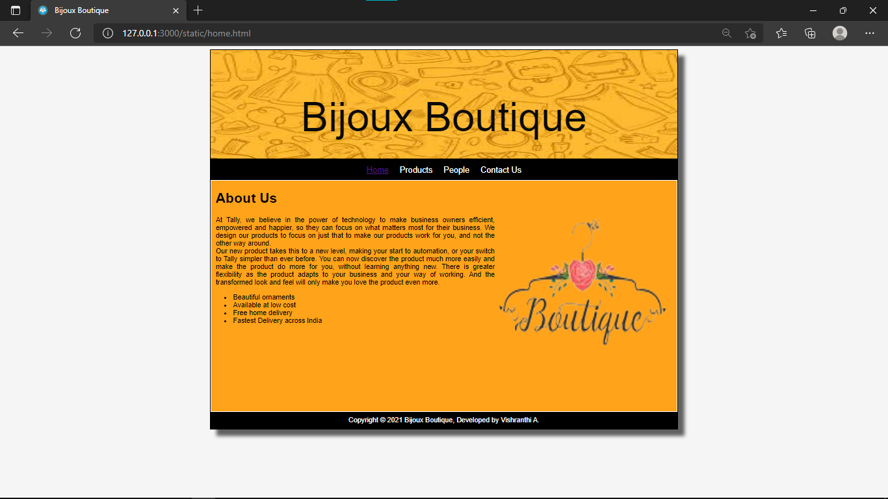
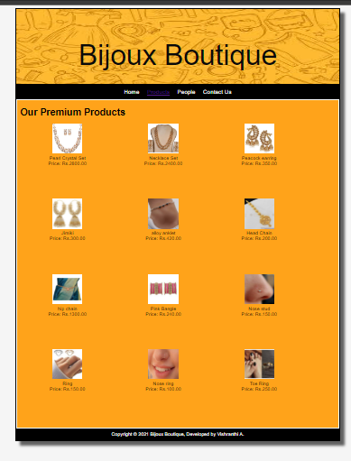
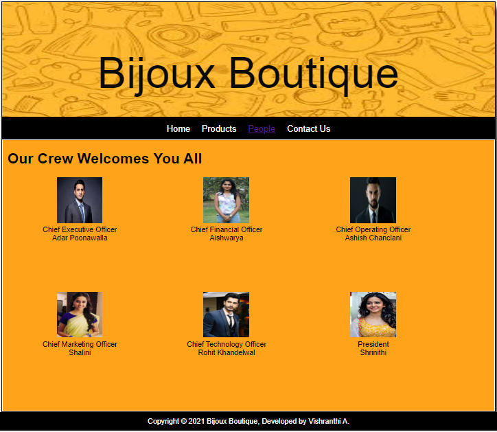
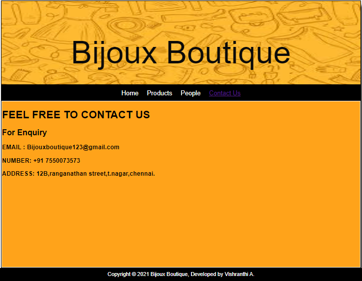

# Web Design for a Software Product Company

## AIM:

To design a static website for a software product company company.

## DESIGN STEPS:

### Step 1:

Requirement collection.

### Step 2:

Creating the layout using HTML and CSS.

### Step 3:

Updating the sample content.

### Step 4:

Choose the appropriate style and color scheme.

### Step 5:

Validate the layout in various browsers.

### Step 6:

Validate the HTML code.

### Step 6:

Publish the website in the given URL.

## PROGRAM :
### Home Page :
```
<!DOCTYPE html>
<html lang="en">
  <head>
    <title>Bijoux Boutique</title>
    <link rel="stylesheet" href="./css/layout.css" />
    <link rel="icon" href="./img/icon.png" type="image/x-icon" />
  </head>

  <body>
    <div class="container">
      <div class="banner">Bijoux Boutique</div>
      <div class="menu">
        <div class="menuitemselected"><a href="/static/home.html">Home</a></div>
        <div class="menuitem"><a href="/static/products.html">Products</a></div>
        <div class="menuitem"><a href="/static/People.html">People</a></div>
        <div class="menuitem"><a href="/static/Contact Us.html">Contact Us</a></div>
      </div>
      <div class="content">
        <div class="homecontent">
          <h1>About Us</h1>
          
          <div class="contenttext">
            At Tally, we believe in the power of technology to make business
            owners efficient, empowered and happier, so they can focus on what
            matters most for their business. We design our products to focus on
            just that to make our products work for you, and not the other way
            around.
            <br />
            Our new product takes this to a new level, making your
            start to automation, or your switch to Tally simpler than ever
            before. You can now discover the product much more easily and make
            the product do more for you, without learning anything new. There is
            greater flexibility as the product adapts to your business and your
            way of working. And the transformed look and feel will only make you
            love the product even more.
            <ul>
              <li>Beautiful ornaments</li>
              <li>Available at low cost</li>
              <li>Free home delivery</li>
              <li>Fastest Delivery across India</li>
            </ul>
          </div>
        </div>
      </div>
      <div class="footer">
        Copyright &#169; 2021 Bijoux Boutique, Developed by Vishranthi A.
      </div>
    </div>
  </body>
</html>
```
### Product Page:
```
<!DOCTYPE html>
<html lang="en">
  <head>
    <title>Bijoux Boutique</title>
    <link rel="stylesheet" href="./css/layout.css" />
    <link rel="icon" href="./img/icon.png" type="image/x-icon" />
  </head>

  <body>
    <div class="container">
      <div class="banner">Bijoux Boutique</div>
      <div class="menu">
        <div class="menuitem"><a href="/static/home.html">Home</a></div>
        <div class="menuitemselected"><a href="/static/products.html">Products</a></div>
        <div class="menuitem"><a href="/static/People.html">People</a></div>
        <div class="menuitem"><a href="/static/Contact Us.html">Contact Us</a></div>
      </div>
      <div class="content">
        <div class="productcontent">    
          <h1>Our Premium Products</h1>
          <div class="productitems">
              <div class="productitem"> 
                  <div class="itemimage">
                  
                  </div>
                  <div class="itemname">Pearl Crystal Set</div>
                  <div class="itemprice">Price: Rs.2800.00 </div>
              </div>
              <div class="productitem"> 
                  <div class="itemimage">
                  
                  </div>
                  <div class="itemname">Necklace Set</div>
                  <div class="itemprice">Price: Rs.2400.00 </div>
              </div>
              <div class="productitem"> 
                <div class="itemimage">
                
                </div>
                <div class="itemname">Peacock earring</div>
                <div class="itemprice">Price: Rs.350.00 </div>
              </div>
              <div class="productitem"> 
                <div class="itemimage">
                
                </div>
                <div class="itemname">Jimiki</div>
                <div class="itemprice">Price: Rs.300.00 </div>
              </div>
              <div class="productitem"> 
                <div class="itemimage">
                
                </div>
                <div class="itemname">alloy anklet</div>
                <div class="itemprice">Price: Rs.420.00 </div>
              </div>
              <div class="productitem"> 
                <div class="itemimage">
                
                </div>
                <div class="itemname">Head Chain</div>
                <div class="itemprice">Price: Rs.200.00 </div>
              </div>
              <div class="productitem"> 
                <div class="itemimage">
                
                </div>
                <div class="itemname">hip chain</div>
                <div class="itemprice">Price: Rs.1300.00 </div>
              </div>
              <div class="productitem"> 
                <div class="itemimage">
                
                </div>
                <div class="itemname">Pink Bangle</div>
                <div class="itemprice">Price: Rs.240.00 </div>
              </div>
              <div class="productitem"> 
                <div class="itemimage">
                
                </div>
                <div class="itemname">Nose stud</div>
                <div class="itemprice">Price: Rs.150.00 </div>
              </div>
              <div class="productitem"> 
                <div class="itemimage">
                
                </div>
                <div class="itemname">Ring</div>
                <div class="itemprice">Price: Rs.150.00 </div>
              </div>
              <div class="productitem"> 
                <div class="itemimage">
                
                </div>
                <div class="itemname">Nose ring</div>
                <div class="itemprice">Price: Rs.100.00 </div>
              </div>
              <div class="productitem"> 
                <div class="itemimage">
                
                </div>
                <div class="itemname">Toe Ring</div>
                <div class="itemprice">Price: Rs.250.00 </div>
              </div>
          </div> 
          </div>        
      </div>
      <div class="footer">
        Copyright &#169; 2021 Bijoux Boutique, Developed by Vishranthi A.
      </div>
    </div>
  </body>
</html>
```
### People Page :
```
<!DOCTYPE html>
<html lang="en">
    <head>
        <title>Bijoux Boutique</title>
        <link rel="stylesheet" href="./css/layout.css" />
        <link rel="icon" href="./img/icon.png" type="image/x-icon" />
    </head>

    <body>
        <div class="container">
            <div class="banner">Bijoux Boutique</div>
            <div class="menu">
                <div class="menuitem"><a href="/static/home.html">Home</a></div>
                <div class="menuitem"><a href="/static/products.html">Products</a></div>
                <div class="menuitemselected"><a href='/static/People.html'>People</a></div>
                <div class="menuitem"><a href='/static/Contact Us.html'>Contact Us</a></div>
            </div>
            <div class="content">
                <div class="productcontent">
                <h1>Our Crew Welcomes You All</h1>
                <div class="productitem">
                <div class="itemimage">
                
            </div>
            <div class="itemname">Chief Executive Officer</div>
            <div class="itemprice">Adar Poonawalla</div>
        </div>
        <div class="productitem">
            <div class="itemimage">
                
            </div>
            <div class="itemname">Chief Financial Officer</div>
            <div class="itemprice">Aishwarya</div>
        </div>
        <div class="productitem">
            <div class="itemimage">
                
            </div>
            <div class="itemname">Chief Operating Officer</div>
            <div class="itemprice">Ashish Chanclani</div>
        </div>
        <div class="productitem">
            <div class="itemimage">
                
            </div>
            <div class="itemname">Chief Marketing Officer</div>
            <div class="itemprice">Shalini</div>
        </div>
        <div class="productitem">
            <div class="itemimage">
                
            </div>
            <div class="itemname">Chief Technology Officer</div>
            <div class="itemprice">Rohit Khandelwal</div>
        </div>
        <div class="productitem">
            <div class="itemimage">
                
            </div>
            <div class="itemname">President</div>
            <div class="itemprice">Shrinithi</div>
        </div>
    </div>
</div>
</div>
<div class="footer">
    Copyright &#169; 2021 Bijoux Boutique, Developed by Vishranthi A.
</div>
</div>
</body>
</html>
```
### Contact Us Page:
```
<!DOCTYPE html>
<html lang="en">
    <head>
        <title>Bijoux Boutique</title>
        <link rel="stylesheet" href="./css/layout.css" />
        <link rel="icon" href="./img/icon.png" type="image/x-icon" />
    </head>

    <body>
        <div class="container">
            <div class="banner">Bijoux Boutique</div>
            <div class="menu">
                <div class="menuitem"><a href="/static/home.html">Home</a></div>
                <div class="menuitem"><a href="/static/products.html">Products</a></div>
                <div class="menuitem"><a href='/static/People.html'>People</a></div>
                <div class="menuitemselected"><a href='/static/Contact Us.html'>Contact Us</a></div>
            </div>
            <div class="content">
                <div class="Peoplecontent">
                    <h1>FEEL FREE TO CONTACT US</h1> 
                    <div class="Peopleitems">
                        <h2>For Enquiry</h2>
                        <h3>EMAIL : Bijouxboutique123@gmail.com</h3>
                        <h3>NUMBER: +91 7550073573</h3>
                        <h3>ADDRESS: 12B,ranganathan street,t.nagar,chennai.</h3>
                    </div>
                </div>
            </div>
        </div>
        <div class="footer">
            Copyright &#169; 2021 Bijoux Boutique, Developed by Vishranthi A.
        </div>
    </div>
</body>
</html>
```
### CSS Code :
```
* {
  box-sizing: border-box;
  font-family: Arial, Helvetica, sans-serif; 
}
body {
  background-color:whitesmoke;
  color: #000000;
}
.container {
  width: 1080px;
  margin-left: auto;
  margin-right: auto;
  border-width: 1px 1px 1px 1px;
  border-style: solid;
  box-shadow: 15px 15px 8px #616161;
}

.banner {
  display: block;
  width: 100%;
  height: 250px;
  text-align: center;
  font-size: 95px;
  background-image: url("/static/img/bg-image.jpg");
  background-size: 100% 100%;
  margin: 0px 0px 0px 0px;
  padding-top: 100px;
  color: #0a0a0a;
}

.menu {
  display: block;
  width: 100%;
  height: 50px;
  font-size: larger;
  background-color: #000000;
  text-align: center;
  padding-top: 15px;
  margin: 0px 0px 0px 0px;
  border-width: 1px;
}

.menuitem {
  display: inline-block;
  margin-left: 10px;
  margin-right: 10px;
}
.menuitemselected {
  display: inline-block;
  margin-left: 10px;
  margin-right: 10px;
  color: #ffffff;
}

.menuitem a {
  text-decoration: none;
  color: #ffffff;
}

.content {
  display: block;
  width: 100%;
  background-color:#ffa31a;
  min-height: 500px;
  margin: 0px 0px 0px 0px;
  border-width: 1px;
  border-color: #ffffff;
  border-style: solid;
}
.homecontent {
  min-height: 500px;
  margin: 10px 10px 10px 10px;
}
.homecontent h1 {
  text-align: left;
}
.homecontent img {
  float: right;
  width: 400px;
  height: 300px;
  margin-left: 10px;
}

.contenttext {
  text-align: justify;
}

.productcontent {
  min-height: 500px;
  margin: 10px 10px 10px 10px;
}

.productcontent h1 {
  text-align: left;
}

.productitems {
  display: block;
}

.productitem {
  display: inline-block;
  width: 30%;
  height: 250px;
  text-align: center;
}

.productitem img {
  width: 100px;
  height: 100px;
  display: block;
}
.productitem .itemimage {
  display: block;
  margin-left: auto;
  margin-right: auto;
  width: 100px;
  margin-bottom: 5px;
}

.productitem .itemname {
  display: block;
}
.productitem .itemprice {
  display: block;
}

.footer {
  display: block;
  width:100%;
  height: 40px;
  background-color: #000000;
  text-align: center;
  padding-top: 10px;
  margin: 0px 0px 0px 0px;
  color: #ffffff;
}
```

## OUTPUT:

### Home Page:



### Product Page:



### People Page:



### Contact Us Page:



## Result:

Thus a website is designed for the software product company and the HTML,CSS code are validated.
